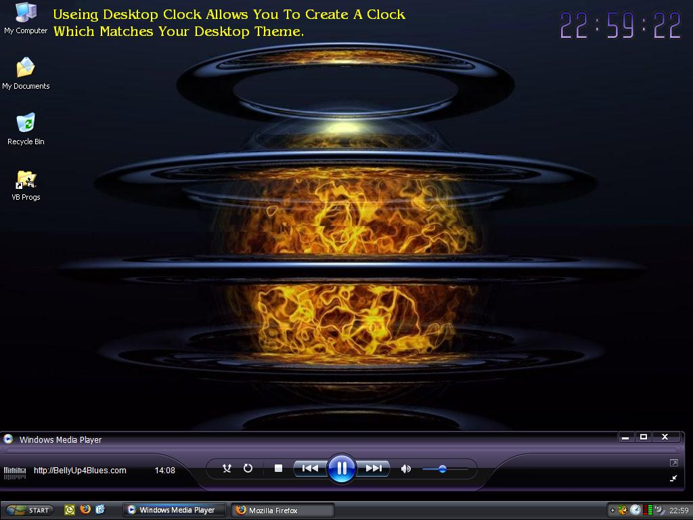

## Desktop Clock \- A New Time

### Description

It is ideal for those how have Windows Blinds and are obsessed with personalising there desktop. It does exactly what it says on the tin! Personalise Visuals And Audio. Easy Access System Tray Entry Too. Skin Chooser, Audio Chooser, Personilised Reminders Etc.
 
### More Info
 

             |
---                |---
**Submitted On**   |2006-05-28 18:42:56
**By**             |[Steven Atkiss](https://github.com/Planet-Source-Code/PSCIndex/blob/master/ByAuthor/steven-atkiss.md)
**Level**          |Intermediate
**User Rating**    |5.0 (10 globes from 2 users)
**Compatibility**  |VB 6\.0
**Category**       |[Complete Applications](https://github.com/Planet-Source-Code/PSCIndex/blob/master/ByCategory/complete-applications__1-27.md)
**World**          |[Visual Basic](https://github.com/Planet-Source-Code/PSCIndex/blob/master/ByWorld/visual-basic.md)
**Archive File**   |[Desktop\_Cl2020349162006\.zip](https://github.com/Planet-Source-Code/steven-atkiss-desktop-clock-a-new-time__1-66456/archive/master.zip)

